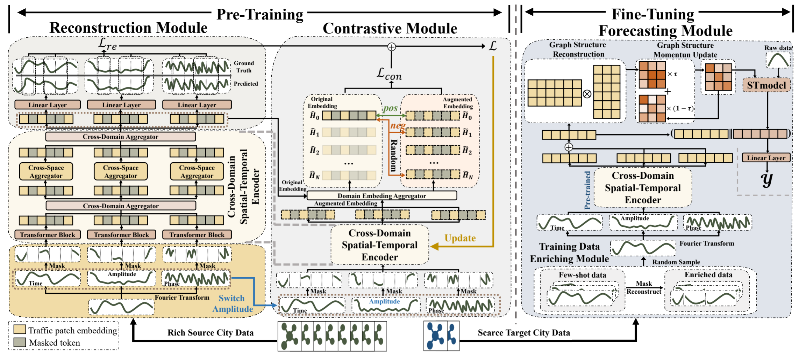

# Frequency Enhanced Pre-training for Cross-city Few-shot Traffic Forecasting [ECMLPKDD 2024]

[ECMLPKDD 2024] Code for "Frequency Enhanced Pre-training for Cross-city Few-shot Traffic Forecasting" (FEPCross)



## Data & pre-trained model
The data and pre-trained model is in https://drive.google.com/file/d/1SEEDAI-v4GdjL4V3-SJZC-D0YXu5n1Az/view?usp=drive_link . Please download it and save them in ```./data``` and ```./save```.


## Reproducibility

The default configs of the four datasets are set in ```./config```. To reproduce the result, please run following command
```bash
python finetune.py --test_dataset ${city}
```
choose a specific city from ```chengdu_m```, ```shenzhen```, ```metr-la```, ```pems-bay```.

## Pretrain from scratch

To pretrain a FEPCross encoder from scratch, run the following command
```bash
python pretrain.py --test_dataset ${city}
```
choose a specific city from ```chengdu_m```, ```shenzhen```, ```metr-la```, ```pems-bay```. If you expect the final model to be finetuned and tested on ```chengdu_m```, FEPCross will be pretrained on ```shenzhen``` dataset. It's the same with the three other cities.

